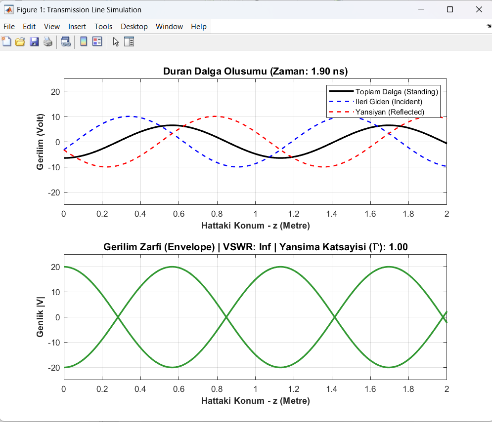

# 🌊 Microwave Engineering: Transmission Line Simulation

This repository contains a MATLAB simulation that visualizes the propagation of electromagnetic waves along a lossless transmission line. It demonstrates the formation of standing waves by computing the superposition of incident (forward) and reflected (backward) voltage waves in the time and spatial domains.

## 📋 Project Overview
In microwave engineering and RF design, understanding how waves travel through a medium and interact with load mismatches is critical. This project simulates a theoretical scenario to calculate and visualize:
* Real-time propagation of Incident ($V^+$) and Reflected ($V^-$) waves.
* The resulting Standing Wave ($V_{total}$).
* The Voltage Envelope, indicating the physical maximum and minimum voltage nodes along the line.
* Reflection Coefficient ($\Gamma$) and Voltage Standing Wave Ratio (VSWR).

---

## 🧮 Theoretical Background
The voltage on a transmission line at any position $z$ and time $t$ can be expressed as the sum of a forward-traveling wave and a backward-traveling wave:

$$V(z,t) = V^+ e^{-\gamma z} e^{j\omega t} + V^- e^{\gamma z} e^{j\omega t}$$

Where:
* **$\gamma$ (Propagation Constant):** $\alpha + j\beta$. Since the simulated line is lossless, attenuation ($\alpha$) is $0$.
* **$\omega$ (Angular Frequency):** Determines the oscillation rate of the wave.
* **$V^+$ and $V^-$:** Amplitudes of the incident and reflected waves, respectively.

---

## ⚙️ Simulation Parameters
The current MATLAB script is configured with the following parameters to simulate an **Open Circuit** load scenario:

| Parameter | Value | Description |
| :--- | :--- | :--- |
| **Line Length ($L$)** | `2 m` | Spatial length of the transmission line. |
| **Angular Freq. ($\omega$)** | `1e9 rad/s` | Operating frequency of the signal. |
| **Phase Velocity ($v_p$)** | `0.6c` | Wave speed in the dielectric medium (60% of the speed of light). |
| **Incident Amplitude ($V_{inc}$)** | `10 V` | Amplitude of the wave traveling towards the load. |
| **Reflected Amplitude ($V_{ref}$)** | `10 V` | Amplitude of the wave reflecting back to the source. |

*Note: Because $V_{inc} = V_{ref}$, the Reflection Coefficient ($\Gamma$) is exactly 1.0, and the VSWR approaches Infinity ($\infty$), which is perfectly characteristic of an open-circuit total reflection.*

---

## 📊 Visual Output & Analysis

The script outputs a two-part dynamic figure:
1. **Dynamic Wave Propagation:** A real-time animation showing the forward wave (blue dashed), backward wave (red dashed), and the resulting standing wave (black solid).
2. **Voltage Envelope:** Traces the absolute peak values ($|V|$) across the line, acting like a simulated slotted-line measurement.

> 
> *Figure: Time-domain standing wave animation and spatial voltage envelope showing total reflection.*

---

## 🚀 How to Run
1. Ensure you have **MATLAB** installed on your system.
2. Clone this repository to your local machine:
   ```bash
   git clone [https://github.com/yourusername/Microwave-Engineering-Simulations.git](https://github.com/yunus-kunduz/Microwave-Engineering-Simulations.git)
